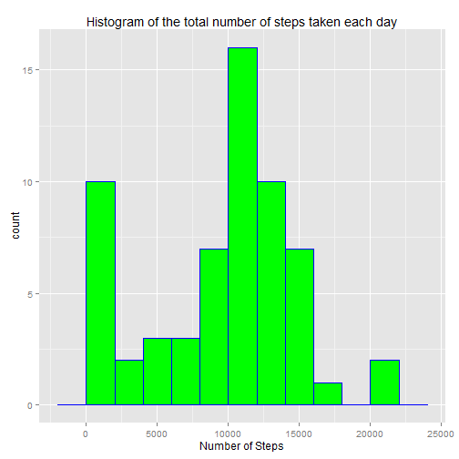
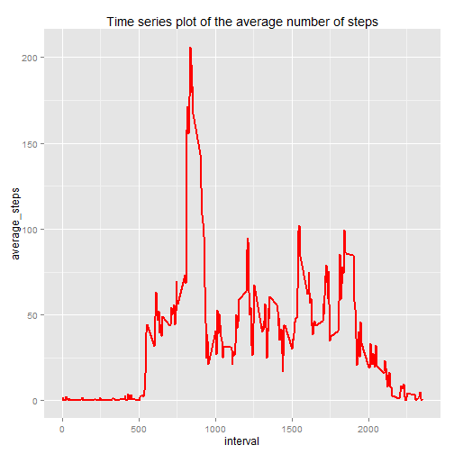
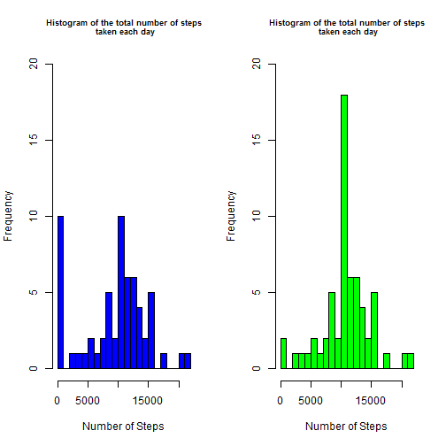
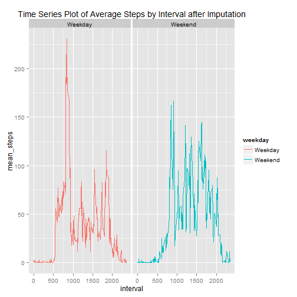

# # Reproducible Research: Peer Assessment 1

## Loading and preprocessing the data

## 1. Load the data (i.e. read.csv()) 


```r
Activity_Data = read.csv("activity.csv", sep=",", header=TRUE)
```

```
## Warning in file(file, "rt"): cannot open file 'activity.csv': No such file
## or directory
```

```
## Error in file(file, "rt"): cannot open the connection
```

## 2. Process/transform the data (if necessary) into a format suitable for your analysis


```r
summary(Activity_Data)
```

```
##      steps             date               interval     
##  Min.   :  0.00   Min.   :2012-10-01   Min.   :   0.0  
##  1st Qu.:  0.00   1st Qu.:2012-10-16   1st Qu.: 588.8  
##  Median :  0.00   Median :2012-10-31   Median :1177.5  
##  Mean   : 37.38   Mean   :2012-10-31   Mean   :1177.5  
##  3rd Qu.: 12.00   3rd Qu.:2012-11-15   3rd Qu.:1766.2  
##  Max.   :806.00   Max.   :2012-11-30   Max.   :2355.0  
##  NA's   :2304
```

```r
Activity_Data[,1] = as.numeric(Activity_Data[,1])
Activity_Data[,2] = as.Date(Activity_Data[,2])
Activity_Data[,3] = as.numeric(Activity_Data[,3])
```


## What is mean total number of steps taken per day?


## 1. Calculate the total number of steps taken per day


```r
tot_nsteps_day <- aggregate(Activity_Data$steps , by = list(Activity_Data$date), FUN = sum ,na.rm=TRUE)
names(tot_nsteps_day) <- c("date","number_steps")
```

## 2. If you do not understand the difference between a histogram and a barplot, 
## research the difference between them. Make a histogram of the total number of steps taken each day


```r
library(ggplot2)
histogram <- ggplot(tot_nsteps_day,aes(number_steps)) +  geom_histogram(binwidth = 2000, col='blue',fill='green') +
  ggtitle("Histogram of the total number of steps taken each day") +
  xlab("Number of Steps")

histogram
```

 


## 3. Calculate and report the mean and median of the total number of steps 
## taken per day


```r
library(plyr)

mean_median =ddply(Activity_Data, .(date), summarize, media = mean(steps, na.rm=TRUE), mediana = median(steps, na.rm=TRUE))

media_total<-mean(tot_nsteps_day$number_steps , na.rm = TRUE)

mediana_total<-median(tot_nsteps_day$number_steps , na.rm = TRUE)
```

## What is the average daily activity pattern?

## Make a time series plot (i.e. type = "l") of the 5-minute interval (x-axis) 
## the average number of steps taken, averaged across all days (y-axis)


```r
average_steps_interval  <- aggregate(Activity_Data$steps , by = list(Activity_Data$interval), FUN = mean ,na.rm=TRUE)
names(average_steps_interval) <- c("interval","average_steps")

time_serie <- ggplot(average_steps_interval,aes(interval,average_steps)) +  geom_line(size=1,col='red') +
  ggtitle("Time series plot of the average number of steps") 

time_serie 
```

 

## Which 5-minute interval, on average across all the days in the dataset, 
## contains the maximum number of steps?


```r
maximum <- average_steps_interval[which.max(average_steps_interval$average_steps),c("interval")]

maximum
```

```
## [1] 835
```

## Imputing missing values

## 1. Calculate and report the total number of missing values in the dataset (i.e. the total number of rows with NAs)


```r
number_missing <- nrow(Activity_Data[is.na(Activity_Data$steps),])
number_missing
```

```
## [1] 2304
```

## 2. Devise a strategy for filling in all of the missing values in the dataset.
##    The strategy does not need to be sophisticated. For example, you could use the mean/median
##    for that day, or the mean for that 5-minute interval, etc.

## The strategy will be the mean of steps by interval.

## 3. Create a new dataset that is equal to the original dataset but with the missing data filled in


```r
dataset <- subset(merge(Activity_Data, average_steps_interval, by="interval"))
```

#Create a function to replace the missing values with the mean by interval.


```r
for (i in 1:length(dataset$steps)){
    if(is.na(dataset$steps[i])){
      dataset$steps[i] <- dataset$average_steps[i]}
    }
```

## 4. Make a histogram of the total number of steps taken each day and Calculate and report the mean
##    and median total number of steps taken per day. Do these values differ from the estimates
##    from the first part of the assignment? What is the impact of imputing missing data on the
##    estimates of the total daily number of steps?


```r
Steps_Day <- aggregate(steps~date, dataset, FUN = sum ,na.rm=TRUE)


par(mfcol = c(1,2))

hist(tot_nsteps_day$number_steps,20, col='blue',main="Histogram of the total number of steps\n taken each day",xlab="Number of Steps",ylim = c(0,20),cex.main=0.75)

hist(Steps_Day$steps,20, col='green',main="Histogram of the total number of steps\n taken each day",xlab="Number of Steps",ylim = c(0,20),cex.main=0.75)
```

 

```r
dev.off()
```

```
## null device 
##           1
```

```r
library(plyr)

mean_median2 =ddply(dataset, .(date), summarize, media = mean(steps, na.rm=TRUE), mediana = median(steps, na.rm=TRUE))

media_total2<-mean(Steps_Day$steps , na.rm = TRUE)

mediana_total2<-median(Steps_Day$steps , na.rm = TRUE)
```


## Are there differences in activity patterns between weekdays and weekends?

## 1. Create a new factor variable in the dataset with two levels - "weekday" and "weekend" 
## indicating whether a given date is a weekday or weekend day


```r
dataset$weekday <- as.factor(ifelse(weekdays(as.Date(dataset$date),abbreviate=TRUE) %in% c("sáb","dom"), "Weekend", "Weekday")) 
```

## 2. Make a panel plot containing a time series plot (i.e. type = "l") of the 5-minute interval
##    (x-axis) and the average number of steps taken, averaged across all weekday days or weekend
##    days (y-axis). See the README file in the GitHub repository to see an example of what this
##    plot should look like using simulated data.


```r
average_steps_IW  <- aggregate(x = dataset$steps, by = list(dataset$interval,dataset$weekday), FUN = mean ,na.rm=TRUE)

names(average_steps_IW) <- c("interval","weekday","mean_steps")

time_serie_wd <- ggplot(average_steps_IW,aes(interval,mean_steps)) +
  ggtitle("Time Series Plot of Average Steps by Interval after Imputation") +
  facet_grid(. ~ weekday) +
  geom_line(size = 0.5,aes(colour=weekday))
time_serie_wd 
```

 

